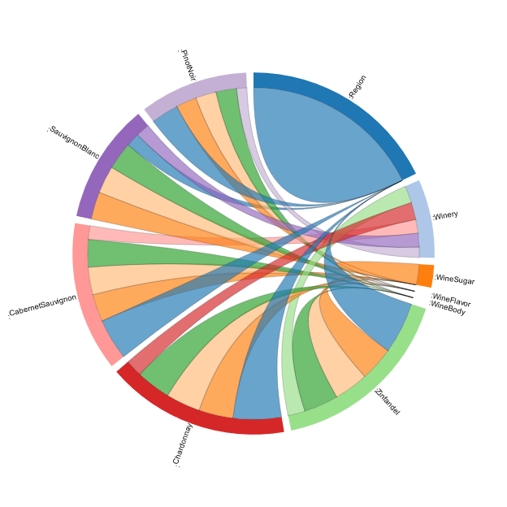
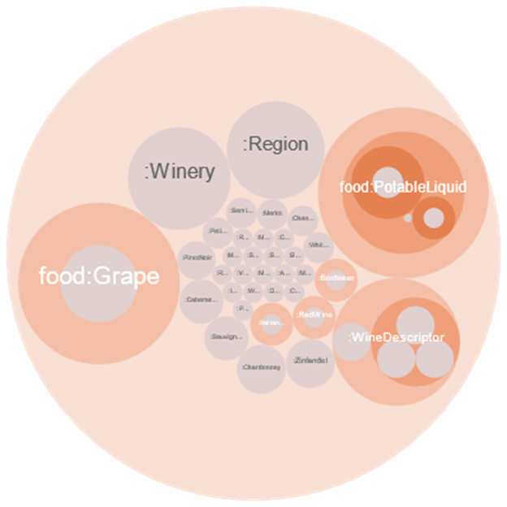
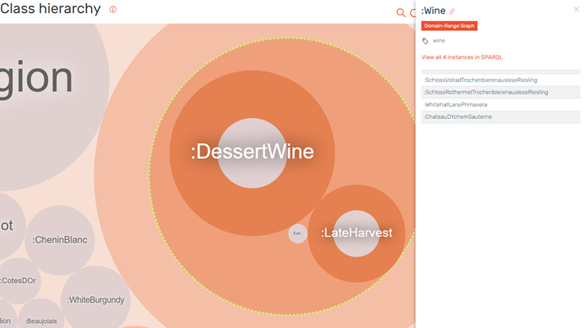
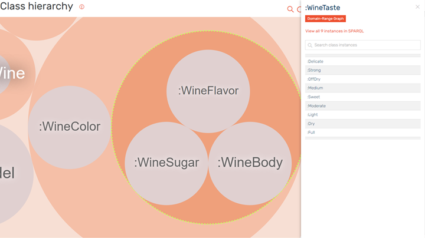
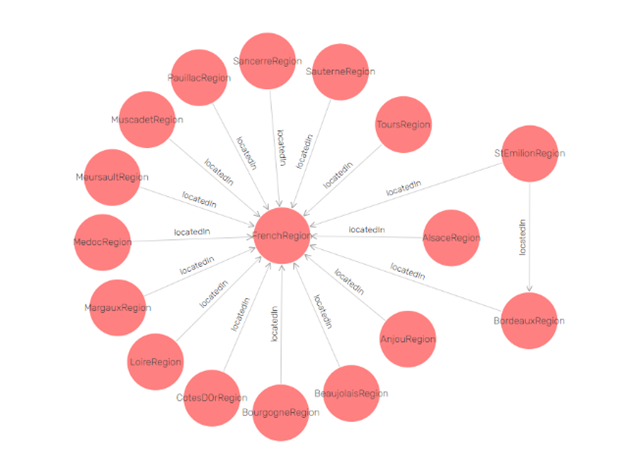

# Demonstration of queries and reasoning with GraphDB and SPARQL on the wine ontology

## Ontology description

The RDF contains 2519 statements. From them 1839 are explicit and 680 are inferred. Relations of the classes are described(figure 1) and the class hierarchy is shown(figure 2). Some of the object properties of the ontology are *vin:hasMaker*, *vin:hasWineDescriptor*, *vin:hasBody*, *vin:hasFlavor*, *vin:hasMaker*, *vin:locatedIn*, *vin:hasDrink*, *vin:hasFood*, *vin:madeFromFruit*.

  |  
:-------------------------:|:-------------------------:
Figure 1 - Relations         |  Figure 2 - Hierarchy

The ontology contains 50 classes. The biggest is food:Grape it has sub class :WineGrape. Other classes are *:Winery*, *:Region*, *:food:PotableLiquid*, *:WineDescripto*r. *:Wine* is subclass of *:food:PotableLiqud*, it has other subclasses(figure 3). Another commonly used class in this project is *:WineDescriptor*. It has subclasses *:WineColor*, *:WineTaste*, where *:WineTaste* has subclasses for *:WineFlavor*, *:WineSugar* and *:WineBody*(figure 4).

  |  
:-------------------------:|:-------------------------:
Figure 3 - Wine        |  Figure 4 - WineTaste

The ontology is not as full as expected in terms of individuals, but still, it has just enough for demonstration purposes of SPARQL queries.
With the execution of the developed queries more about the ontology is learned.

||
|:--:|
|Figure 5 - Visual Graph|

Visual graph for FreachRegion is presented in figure 5. Information about StEmilionRegion is queried in one of the queries from the last part. It is located in French and Bordeaux Regions. This is view with inferred statements. GraphDB’s visual graph proved very convinient for exploring relations between classes and properties. I have used it while developing big portion of the queries. The figure here is one for giving idea what does the visual graph look like after searching for specific class.

## Algorithms and methods in GraphDB

GraphDB uses a notation close to R-Entailment defined by Horst. RDFS inference is achieved via a set of axiomatic triples and entailment rules. RDFS extensions are defined for more general rule support and fragment of OWL. R-entailment extends RDFS-entailment in the following way. It can operate on the basics of nay set of rules. It operates over generalized RDF graphs, where blank nodes appear as predicates. Rules without premises are used to declare axiomatic statements. Rules without consequences are used to detect inconsistencies.

There are two main reasoning strategies for rule-bases inference – forward chaining, backward chaining and hybrid chaining. Forward chaining starts from known facts and perform inference in deductive fashion. This involves applying the inference rules to the known facts to generate new facts. The rules can be re-applied to the inferred facts as well. This process is iterative and is repeated until no new facts can be generated. Backward chaining starts with a fact to be proved or a query to be answered. Usually, the reasoner examines the knowledge base to if the fact is present and if not, it examines the ruleset to see if it can prove it from the rules it has. A check might be made to see what supportive facts can be used and tries to prove them in similar manner.  This process terminates when either all the leaves of the tree have proofs or no new candidate solutions can be found. Query processing is similar, but only stops when all search paths have been explored.

The advantages of forward chaining are that when all inferences have been computed query answering can be processed very fast. Disadvantages are that because inference are computed at load time there is high initialization cost and updates are expensive. There also is high memory usage.

Advantages of backward chaining are that there is no inferencing cost at start-up the space requirements are minimal. The disadvantage is inference must be done each time a query is answered.

Both strategies have pros and cons this is why optimized hybrid strategies are developed where there is partial forward chaining at data loading time and there is partial backward chaining at query time. 

GraphDB can be configured via ruleset – sets of axiomatic triples, consistency checks and entailment rules. Which determine the applied semantics. A rule sets consists of prefixes, axioms(axiomatic triples) and custom rules. All of this are mandatory and should appear in this order. Comments are allows using Java notation. For historic reasons, the way in which terms are written is different from Turtle and SPARQL. The URLs in prefixes are written without angle brackets. Variables are written without ? or $ symbol. URLs are written in brackets. Datatype URLs are written without brackets. Some predefined Rulesets are empty, rdfs, owl-hors, owl-max, owl2-rl, owl2-ql.

## Queries

There are 16 queries. For each query there is a comment showing what is interesting about it.
